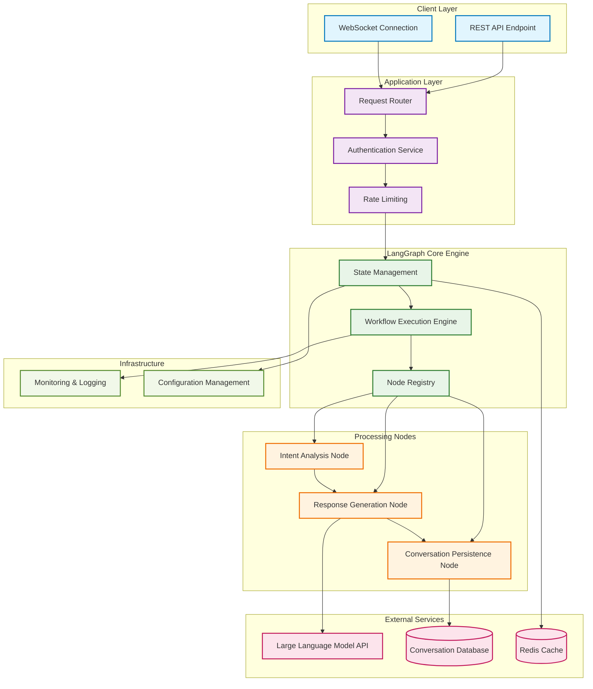
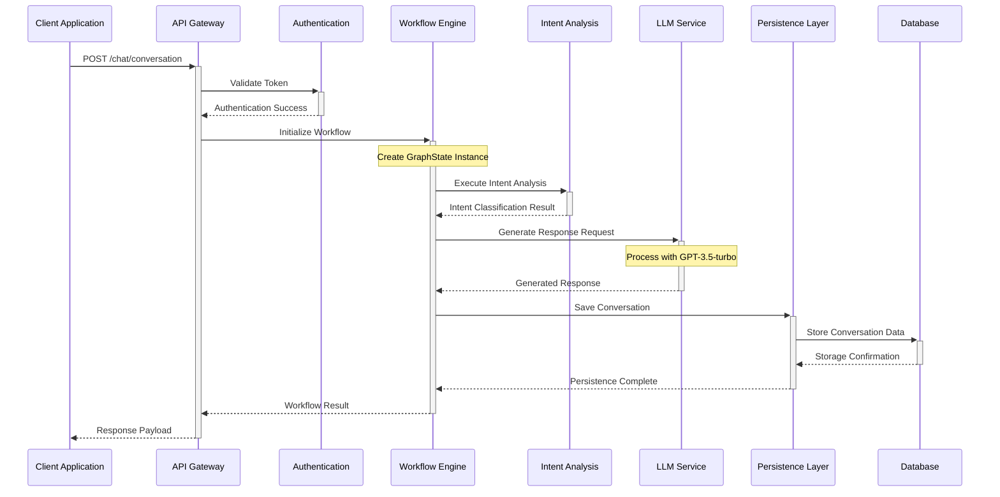
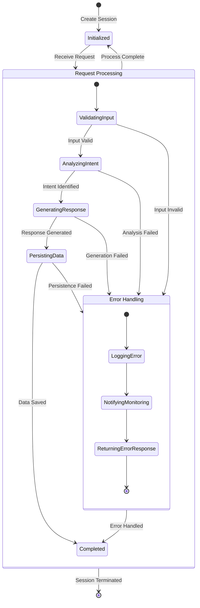
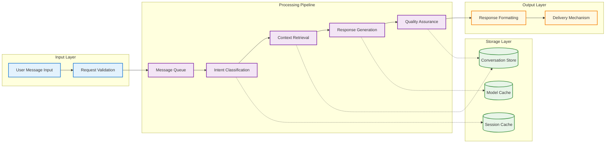
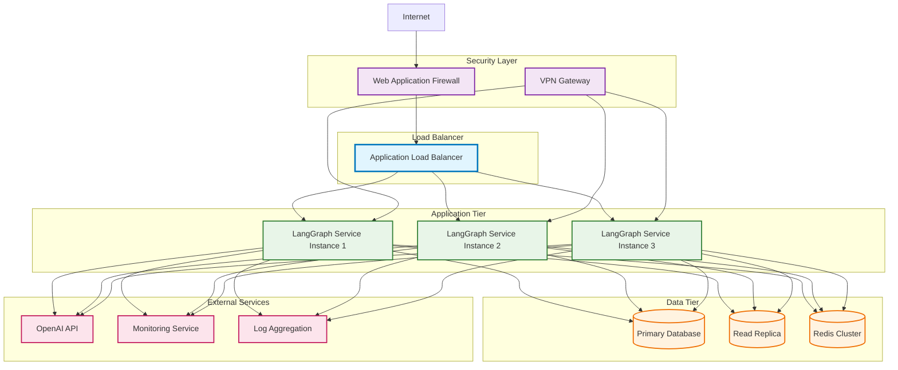

# LangGraph 企业级工作流架构设计

## 系统架构概览



## 工作流程执行序列



## 状态管理架构



## 数据流架构



## 组件关系图

```mermaid
classDiagram
    class GraphStateManager {
        -UUID sessionId
        -List~BaseMessage~ messageHistory
        -String currentIntent
        -ProcessingStatus status
        -Timestamp lastUpdate
        +initializeSession() SessionContext
        +updateState(StateUpdate) void
        +getSessionState() GraphState
        +validateState() ValidationResult
    }
    
    class WorkflowExecutor {
        -NodeRegistry registry
        -ExecutionContext context
        -List~ExecutionStep~ pipeline
        +executeWorkflow(GraphState) ExecutionResult
        +addExecutionNode(Node) void
        +validatePipeline() ValidationResult
        +handleException(Exception) ErrorResponse
    }
    
    class IntentAnalysisNode {
        -IntentClassifier classifier
        -ConfidenceThreshold threshold
        +processMessage(Message) IntentResult
        +updateClassifier(TrainingData) void
        +getConfidenceScore() Double
    }
    
    class ResponseGenerationNode {
        -LLMConnector llmConnector
        -PromptTemplate template
        -ResponseValidator validator
        +generateResponse(Context) GeneratedResponse
        +validateResponse(Response) ValidationResult
        +optimizePrompt(Feedback) void
    }
    
    class ConversationPersistenceNode {
        -DatabaseConnector dbConnector
        -ConversationSerializer serializer
        +persistConversation(ConversationData) PersistenceResult
        +retrieveHistory(SessionId) ConversationHistory
        +archiveSession(SessionId) ArchiveResult
    }
    
    class LLMServiceConnector {
        -APIConfiguration config
        -ConnectionPool pool
        -RateLimiter rateLimiter
        +sendRequest(PromptData) APIResponse
        +validateConnection() ConnectionStatus
        +handleRateLimit() RetryStrategy
    }
    
    GraphStateManager ||--o{ WorkflowExecutor : manages
    WorkflowExecutor ||--o{ IntentAnalysisNode : executes
    WorkflowExecutor ||--o{ ResponseGenerationNode : executes
    WorkflowExecutor ||--o{ ConversationPersistenceNode : executes
    ResponseGenerationNode ||--|| LLMServiceConnector : uses
    ConversationPersistenceNode ||--|| DatabaseConnector : uses
    
    class DatabaseConnector {
        -ConnectionString connectionString
        -ConnectionPool pool
        +executeQuery(Query) ResultSet
        +executeTransaction(TransactionBlock) TransactionResult
    }
    
    class ValidationResult {
        -Boolean isValid
        -List~ValidationError~ errors
        -String summary
    }
    
    class ExecutionResult {
        -ExecutionStatus status
        -Object result
        -List~ExecutionMetric~ metrics
        -Duration executionTime
    }
```

## 部署架构图



## 监控和可观测性

```mermaid
graph TD
    subgraph "Application Metrics"
        RequestLatency[Request Latency]
        ThroughputMetrics[Throughput Metrics]
        ErrorRate[Error Rate]
        ResourceUtilization[Resource Utilization]
    end
    
    subgraph "Business Metrics"
        ConversationSuccess[Conversation Success Rate]
        UserSatisfaction[User Satisfaction Score]
        IntentAccuracy[Intent Classification Accuracy]
        ResponseQuality[Response Quality Metrics]
    end
    
    subgraph "Infrastructure Metrics"
        CPUUsage[CPU Usage]
        MemoryUsage[Memory Usage]
        NetworkIO[Network I/O]
        DiskUsage[Disk Usage]
    end
    
    subgraph "Alerting System"
        ThresholdMonitoring[Threshold Monitoring]
        AnomalyDetection[Anomaly Detection]
        IncidentManagement[Incident Management]
    end
    
    subgraph "Dashboards"
        OperationalDashboard[Operational Dashboard]
        BusinessDashboard[Business Intelligence Dashboard]
        TechnicalDashboard[Technical Performance Dashboard]
    end
    
    RequestLatency --> ThresholdMonitoring
    ErrorRate --> AnomalyDetection
    ConversationSuccess --> IncidentManagement
    
    ThresholdMonitoring --> OperationalDashboard
    AnomalyDetection --> TechnicalDashboard
    IncidentManagement --> BusinessDashboard
    
    ResourceUtilization --> TechnicalDashboard
    UserSatisfaction --> BusinessDashboard
    CPUUsage --> OperationalDashboard
    
    classDef appMetrics fill:#e3f2fd,stroke:#1976d2,stroke-width:2px
    classDef businessMetrics fill:#e8f5e8,stroke:#388e3c,stroke-width:2px
    classDef infraMetrics fill:#fff3e0,stroke:#f57c00,stroke-width:2px
    classDef alerting fill:#fce4ec,stroke:#c2185b,stroke-width:2px
    classDef dashboards fill:#f3e5f5,stroke:#7b1fa2,stroke-width:2px
    
    class RequestLatency,ThroughputMetrics,ErrorRate,ResourceUtilization appMetrics
    class ConversationSuccess,UserSatisfaction,IntentAccuracy,ResponseQuality businessMetrics
    class CPUUsage,MemoryUsage,NetworkIO,DiskUsage infraMetrics
    class ThresholdMonitoring,AnomalyDetection,IncidentManagement alerting
    class OperationalDashboard,BusinessDashboard,TechnicalDashboard dashboards
```


