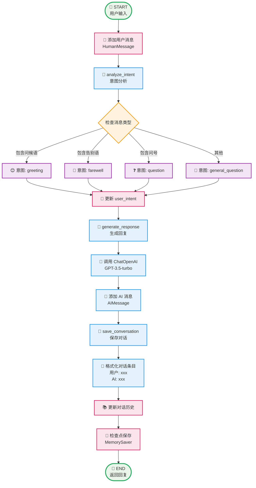
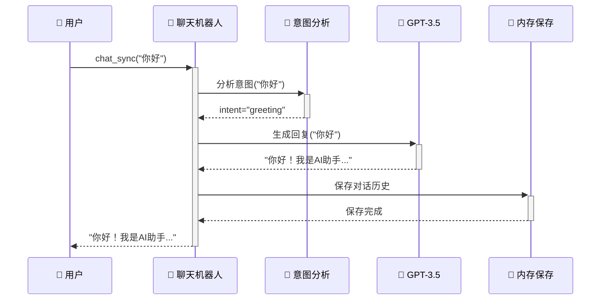
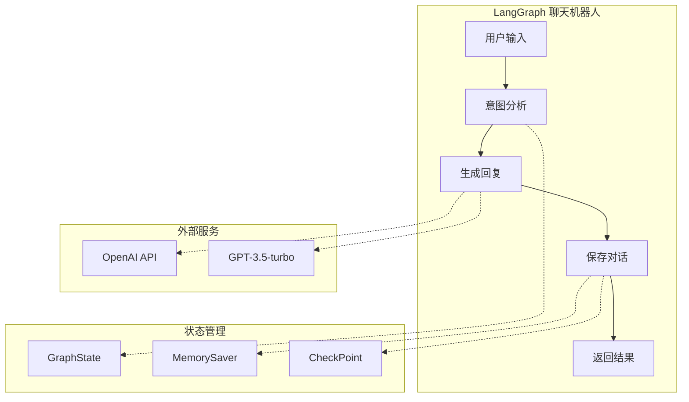
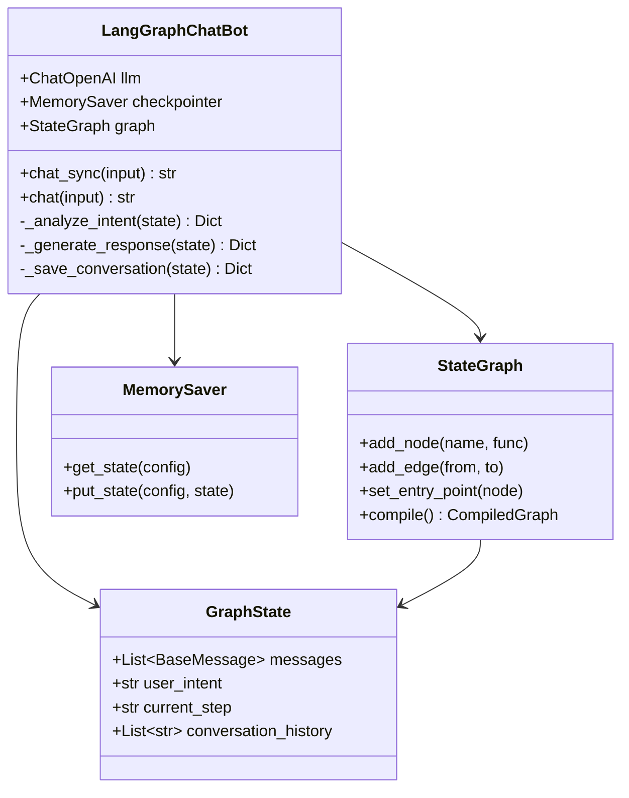

# LangGraph 工作流程 - Mermaid 图表代码

## 🔄 主要工作流程图



## 📊 状态变化流程图

```mermaid
graph LR
    InitState[📋 初始状态<br/>messages: []<br/>user_intent: ''<br/>current_step: 'start'] 
    
    InitState --> AddMsg[📝 添加用户消息<br/>messages: [HumanMessage]]
    AddMsg --> IntentState[🧠 意图分析完成<br/>user_intent: 'greeting'<br/>current_step: 'intent_analyzed']
    IntentState --> ResponseState[💬 回复生成完成<br/>messages: [Human, AI]<br/>current_step: 'response_generated']
    ResponseState --> SaveState[💾 对话保存完成<br/>conversation_history: [...]<br/>current_step: 'conversation_saved']
    
    %% 样式定义
    classDef stateBox fill:#f0f8ff,stroke:#4682b4,stroke-width:2px
    class InitState,AddMsg,IntentState,ResponseState,SaveState stateBox
```

## ⚡ 执行时序图



## 🏗️ 简化架构图



## 🔧 组件关系图



## 📋 使用方法

### 在 Markdown 文档中使用
直接复制上面的代码块到您的 Markdown 文件中，支持 Mermaid 的平台会自动渲染。

### 在在线工具中使用
- [Mermaid Live Editor](https://mermaid.live/)
- [GitHub](https://github.com) (支持在 README.md 中渲染)
- [GitLab](https://gitlab.com) (支持在文档中渲染)
- [Notion](https://notion.so) (通过 Mermaid 块)

### 在代码编辑器中使用
- VS Code: 安装 "Mermaid Preview" 插件
- Typora: 内置支持
- Obsidian: 内置支持
